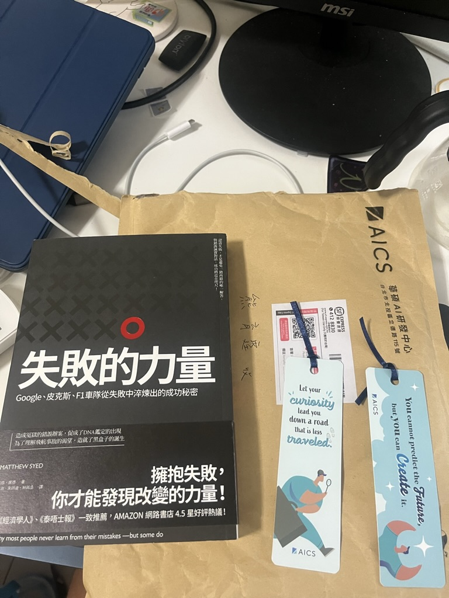

AICS 應該算是近期又紅起來的團隊，業務大概是在做「智慧醫療」，我面試時他們有在跟政府合作一些大案子。

其實 AICS 在前陣子有一些不太好的消息，只要 google 一下 「AICS 面試 ptt」就可以查到了，大致上是在分享一些很糟糕的面試體驗，這邊就不再多說。另外我有不少系上強者朋友也有去面試，看了他們的心得文，有不少都是被無聲卡（小風竟然會被無聲卡）或者被刷掉。

不過我在投履歷時也沒有想那麼多，AICS 是我最早期投的幾家公司之一，那時我甚至沒有請我的 googler 朋友幫忙修履歷，直到我面試的第二關前十分鐘左右才送一份更清楚明瞭的履歷給人資。

這次面試的過程全線上，我不知道是不是我的運氣比較好，整個面試過程中完全沒有遇到網路上講到的那些負面狀況。

## OA

沒有很難，就不多寫了。不過我是在 OA deadline 前三個小時才看到信，而且那時候我在上課 QQ 根本來不及寫，於是就在寄信過去要求延長一天。

## 一面

總共一個小時。

一開始是從履歷問一些我的經歷，差不多前半小時都是這樣子。在後半小時是問 coding 題，用自己習慣的 IDE 寫就好，但我有點忘記問什麼了，大概是 leetcode medium 等級的題目。面試過程中其實聊得蠻開心的，面試官也有跟我說通常他會比較注重哪些細節，當然這些細節因面試官而異。

## 二面

總共三個小時，有三關，每關一個小時。

前兩關也是考 coding 題，大概也是 leetcode medium 的難度，跟第一關差不多。我那時已經至少刷了500題了，解那些問題基本上很順。

特別拿出來提一下，第二關考的題目是 [Jump Game II - LeetCode](https://leetcode.com/problems/jump-game-ii/)，我一開始是給出了很爛的 $O(N^2)$ 的 DP 解，面試官給出了很多 follow up 後我才想到一個 $O(N)$ 解。

第三關是主管直接來面試，也是一樣簡介了公司最近的狀況，並且跟我聊一些我以前做過的事情。我覺得主管還蠻真誠的，雖然隔了一道螢幕，但感覺他會用心對待每一位員工和面試者。

面試的最後，主管還問了我整個面試過程有沒有遇到什麼不好的狀況（我有點忘記他的原話是什麼了），我也誠實的回答如果滿分十分我可以給到十分，我跟每一位面試官的溝通都非常順暢。

## 結果

面試完過了大概兩個小時，人資就發信過來說我通過面試了，並且我可以獲贈一本書（總共五本讓我挑一本）。隔天主管也發信來恭喜我通過面試。我覺得這一部分 AICS 做得蠻用心的，得知事後還有送書我也蠻驚喜的。

AICS 給的 package 很好，說實話我聽到數字的當下有點驚訝（可能是我真的太菜了）。不過我同時得到另一份對我來說更好的機會，跟三位這個暑假在 AICS 實習的學弟妹，以及在那裡工作過的學姊討論過以後，我覺得每週要花超過六七個小時通勤真的太多了，而且我短期內還是想住在台大附近。因此，我想了兩個禮拜以後還是忍痛拒絕了這個 offer...

我真的覺得面試的主管對我很好，如果未來有機會的話還是會想去看看（不是客套話）。

## 後記

我遇到的面試官都很平易近人，這點真的在我的面試過程中幫助很大。

我覺得 AICS 要跟政府合作的案子真的是大工程，如果真的參與整個案子的話，寫在履歷上肯定會加不少分。

然後我兩次拿到 offer 的面試早上都有去運動，是技擊散打的校隊晨訓。我現在是猜運動可以促進血液循環、幫助大腦思考啦，還是猜的，畢竟樣本不夠多。
